# ERD Diagram - SIMPEG UNISM

## 📋 Overview

Dokumen ini berisi Entity Relationship Diagram (ERD) untuk database sistem SIMPEG (Sistem Informasi Manajemen Pegawai) Universitas Islam Negeri Sultan Maulana Hasanuddin.

## 🎨 Entity Relationship Diagram

### Complete Database ERD

```mermaid
erDiagram
    USERS {
        bigint id PK
        string name
        string username UK
        string phone UK
        char prodi
        bigint oauth_client_role_id
        timestamp email_verified_at
        string remember_token
        timestamp created_at
        timestamp updated_at
    }

    EMPLOYEES {
        string id PK
        string id_sp UK
        string nik UK
        string nidn
        string full_name
        string birth_place
        date birth_date
        enum gender
        string title_prefix
        string title_suffix
        bigint field_of_study_id
        bigint education_id
        string ektp
        string family_card_no
        string ktp_address
        string current_address
        bigint religion_id
        bigint employment_status_id
        string phone_number
        string email
        bigint employment_type_id
        bigint activity_id
        string photo
        date employment_date
        string role
        string main_duties
        string lecturer_certification
        bigint functional_position_id
        timestamp created_at
        timestamp updated_at
        timestamp deleted_at
    }

    DEPARTEMENTS {
        bigint id PK
        string name
        boolean is_active
        timestamp created_at
        timestamp updated_at
        timestamp deleted_at
    }

    DIVISIONS {
        bigint id PK
        bigint department_id FK
        string name
        boolean is_active
        timestamp created_at
        timestamp updated_at
        timestamp deleted_at
    }

    POSITIONS {
        bigint id PK
        string name
        boolean is_active
        timestamp created_at
        timestamp updated_at
        timestamp deleted_at
    }

    STRUCTURAL_PERIODS {
        bigint id PK
        date start_date
        date end_date
        boolean is_active
        timestamp created_at
        timestamp updated_at
        timestamp deleted_at
    }

    STRUCTURALS {
        string id PK
        bigint structural_period_id FK
        bigint department_id FK
        bigint division_id FK
        bigint position_id FK
        string employee_nik FK
        timestamp created_at
        timestamp updated_at
        timestamp deleted_at
    }

    STRUCTURAL_HISTORIES {
        bigint id PK
        string employee_nik FK
        string status
        string description
        timestamp created_at
        timestamp updated_at
        timestamp deleted_at
    }

    JABFUNGS {
        bigint id PK
        string jabfung
        string subJabfung
        integer angkaKreditMinimum
        timestamp created_at
        timestamp updated_at
        timestamp deleted_at
    }

    SESSIONS {
        string id PK
        bigint user_id FK
        string ip_address
        text user_agent
        longtext payload
        integer last_activity
    }

    PASSWORD_RESET_TOKENS {
        string email PK
        string token
        timestamp created_at
    }

    RELIGIONS {
        bigint id PK
        string name
        boolean is_active
        timestamp created_at
        timestamp updated_at
        timestamp deleted_at
    }

    EDUCATIONS {
        bigint id PK
        string level
        string name
        boolean is_active
        timestamp created_at
        timestamp updated_at
        timestamp deleted_at
    }

    FIELDS_OF_STUDY {
        bigint id PK
        string name
        string code
        boolean is_active
        timestamp created_at
        timestamp updated_at
        timestamp deleted_at
    }

    EMPLOYMENT_STATUS {
        bigint id PK
        string name
        string description
        boolean is_active
        timestamp created_at
        timestamp updated_at
        timestamp deleted_at
    }

    EMPLOYMENT_TYPES {
        bigint id PK
        string name
        string description
        boolean is_active
        timestamp created_at
        timestamp updated_at
        timestamp deleted_at
    }

    ACTIVITIES {
        bigint id PK
        string name
        string description
        boolean is_active
        timestamp created_at
        timestamp updated_at
        timestamp deleted_at
    }

    EMPLOYEE_HISTORIES {
        bigint id PK
        string employee_nik FK
        string field_name
        string old_value
        string new_value
        string changed_by
        timestamp changed_at
    }

    %% Core Relationships
    DEPARTEMENTS ||--o{ DIVISIONS : "has many"
    STRUCTURAL_PERIODS ||--o{ STRUCTURALS : "has many"
    DEPARTEMENTS ||--o{ STRUCTURALS : "has many"
    DIVISIONS ||--o{ STRUCTURALS : "has many"
    POSITIONS ||--o{ STRUCTURALS : "has many"
    EMPLOYEES ||--o{ STRUCTURALS : "has many"
    EMPLOYEES ||--o{ STRUCTURAL_HISTORIES : "has many"
    EMPLOYEES ||--o{ EMPLOYEE_HISTORIES : "has many"
    USERS ||--o{ SESSIONS : "has many"

    %% Reference table relationships
    RELIGIONS ||--o{ EMPLOYEES : "has many"
    EDUCATIONS ||--o{ EMPLOYEES : "has many"
    FIELDS_OF_STUDY ||--o{ EMPLOYEES : "has many"
    EMPLOYMENT_STATUS ||--o{ EMPLOYEES : "has many"
    EMPLOYMENT_TYPES ||--o{ EMPLOYEES : "has many"
    ACTIVITIES ||--o{ EMPLOYEES : "has many"
    JABFUNGS ||--o{ EMPLOYEES : "has many"
```



## 🏗️ Diagram Components

### 1. Core Tables (8 entities)

- **USERS**: User authentication dan management
- **EMPLOYEES**: Data utama pegawai
- **DEPARTEMENTS**: Data departemen
- **DIVISIONS**: Data divisi
- **POSITIONS**: Data posisi/jabatan
- **STRUCTURAL_PERIODS**: Periode struktur organisasi
- **STRUCTURALS**: Assignment pegawai ke struktur
- **SESSIONS**: Session management

### 2. Reference Tables (7 entities)

- **RELIGIONS**: Referensi agama
- **EDUCATIONS**: Referensi tingkat pendidikan
- **FIELDS_OF_STUDY**: Referensi bidang ilmu
- **EMPLOYMENT_STATUS**: Referensi status pegawai
- **EMPLOYMENT_TYPES**: Referensi jenis ikatan kerja
- **ACTIVITIES**: Referensi aktivitas pegawai
- **JABFUNGS**: Referensi jabatan fungsional

### 3. Audit Tables (3 entities)

- **EMPLOYEE_HISTORIES**: Riwayat perubahan data pegawai
- **STRUCTURAL_HISTORIES**: Riwayat perubahan struktur
- **PASSWORD_RESET_TOKENS**: Token reset password

## 🔗 Relationship Types

### 1. One-to-Many Relationships

- **DEPARTEMENTS** → **DIVISIONS**: Satu departemen memiliki banyak divisi
- **DEPARTEMENTS** → **STRUCTURALS**: Satu departemen memiliki banyak assignment struktur
- **DIVISIONS** → **STRUCTURALS**: Satu divisi memiliki banyak assignment struktur
- **POSITIONS** → **STRUCTURALS**: Satu posisi dapat diisi banyak pegawai
- **STRUCTURAL_PERIODS** → **STRUCTURALS**: Satu periode memiliki banyak assignment
- **EMPLOYEES** → **STRUCTURALS**: Satu pegawai dapat memiliki banyak posisi
- **EMPLOYEES** → **EMPLOYEE_HISTORIES**: Satu pegawai memiliki banyak riwayat
- **EMPLOYEES** → **STRUCTURAL_HISTORIES**: Satu pegawai memiliki banyak riwayat struktur
- **USERS** → **SESSIONS**: Satu user memiliki banyak session

### 2. Reference Relationships

- **RELIGIONS** → **EMPLOYEES**: Satu agama dimiliki banyak pegawai
- **EDUCATIONS** → **EMPLOYEES**: Satu pendidikan dimiliki banyak pegawai
- **FIELDS_OF_STUDY** → **EMPLOYEES**: Satu bidang ilmu dimiliki banyak pegawai
- **EMPLOYMENT_STATUS** → **EMPLOYEES**: Satu status dimiliki banyak pegawai
- **EMPLOYMENT_TYPES** → **EMPLOYEES**: Satu jenis ikatan kerja dimiliki banyak pegawai
- **ACTIVITIES** → **EMPLOYEES**: Satu aktivitas dimiliki banyak pegawai
- **JABFUNGS** → **EMPLOYEES**: Satu jabatan fungsional dimiliki banyak pegawai

## 📊 Entity Attributes Summary

### Primary Keys

- **Auto-incrementing bigint**: USERS, DEPARTEMENTS, DIVISIONS, POSITIONS, STRUCTURAL_PERIODS, RELIGIONS, EDUCATIONS, FIELDS_OF_STUDY, EMPLOYMENT_STATUS, EMPLOYMENT_TYPES, ACTIVITIES, JABFUNGS, EMPLOYEE_HISTORIES, STRUCTURAL_HISTORIES
- **String**: EMPLOYEES.id, STRUCTURALS.id, SESSIONS.id
- **Email**: PASSWORD_RESET_TOKENS.email

### Foreign Keys

- **DEPARTEMENTS.id**: Referenced by DIVISIONS.department_id, STRUCTURALS.department_id
- **DIVISIONS.id**: Referenced by STRUCTURALS.division_id
- **POSITIONS.id**: Referenced by STRUCTURALS.position_id
- **STRUCTURAL_PERIODS.id**: Referenced by STRUCTURALS.structural_period_id
- **EMPLOYEES.nik**: Referenced by STRUCTURALS.employee_nik, EMPLOYEE_HISTORIES.employee_nik, STRUCTURAL_HISTORIES.employee_nik
- **USERS.id**: Referenced by SESSIONS.user_id
- **Reference tables**: Referenced by EMPLOYEES untuk berbagai field referensi

### Unique Constraints

- **USERS**: username, phone
- **EMPLOYEES**: id_sp, nik
- **FIELDS_OF_STUDY**: code
- **STRUCTURALS**: structural_period_id + department_id + division_id + position_id (composite unique)

## 🎯 Business Rules Visualization

### 1. Organizational Hierarchy

```
DEPARTEMENTS (1) ----< (N) DIVISIONS
    |                        |
    |                        |
    v                        v
STRUCTURALS <--------------- STRUCTURALS
    |                        |
    |                        |
    v                        v
POSITIONS (1) ----< (N) STRUCTURALS
```

### 2. Employee Assignment

```
EMPLOYEES (1) ----< (N) STRUCTURALS
    |                        |
    |                        |
    v                        v
STRUCTURAL_PERIODS (1) ----< (N) STRUCTURALS
```

### 3. Audit Trail

```
EMPLOYEES (1) ----< (N) EMPLOYEE_HISTORIES
    |                        |
    |                        |
    v                        v
EMPLOYEES (1) ----< (N) STRUCTURAL_HISTORIES
```

### 4. Reference Data

```
RELIGIONS (1) ----< (N) EMPLOYEES
EDUCATIONS (1) ----< (N) EMPLOYEES
FIELDS_OF_STUDY (1) ----< (N) EMPLOYEES
EMPLOYMENT_STATUS (1) ----< (N) EMPLOYEES
EMPLOYMENT_TYPES (1) ----< (N) EMPLOYEES
ACTIVITIES (1) ----< (N) EMPLOYEES
JABFUNGS (1) ----< (N) EMPLOYEES
```

## 🔧 ERD Design Principles

### 1. Normalization

- **Third Normal Form (3NF)**: Database dinormalisasi hingga 3NF
- **Elimination of Redundancy**: Tidak ada data redundan
- **Atomic Values**: Setiap field memiliki nilai atomik
- **Functional Dependencies**: Semua functional dependencies terpenuhi

### 2. Referential Integrity

- **Foreign Key Constraints**: Semua relasi menggunakan foreign key
- **Cascade Rules**: Appropriate cascade rules untuk data consistency
- **Set Null Rules**: Set null untuk optional references
- **Restrict Rules**: Restrict untuk mandatory references

### 3. Data Integrity

- **Primary Keys**: Setiap entity memiliki primary key
- **Unique Constraints**: Field yang harus unik menggunakan unique constraint
- **Check Constraints**: Validasi data menggunakan check constraint
- **Not Null Constraints**: Field yang wajib menggunakan not null

### 4. Performance Optimization

- **Indexing Strategy**: Index pada field yang sering digunakan
- **Composite Indexes**: Composite indexes untuk kombinasi field
- **Foreign Key Indexes**: Index pada foreign key fields
- **Search Indexes**: Index pada field yang sering dicari

## 📈 ERD Maintenance

### 1. Version Control

- **Change Tracking**: Track perubahan ERD
- **Version History**: Maintain version history
- **Migration Scripts**: Generate migration scripts dari ERD changes
- **Documentation Updates**: Update documentation sesuai ERD changes

### 2. Validation

- **Consistency Check**: Validate ERD consistency
- **Business Rules**: Validate business rules implementation
- **Performance Impact**: Assess performance impact dari changes
- **Data Migration**: Plan data migration untuk schema changes

### 3. Documentation

- **Entity Documentation**: Document setiap entity
- **Relationship Documentation**: Document setiap relationship
- **Business Rules**: Document business rules
- **Constraints**: Document constraints dan validation rules

---

**Dokumen ini dibuat**: 2024-01-01  
**Versi**: v1.0.0  
**Status**: Complete
