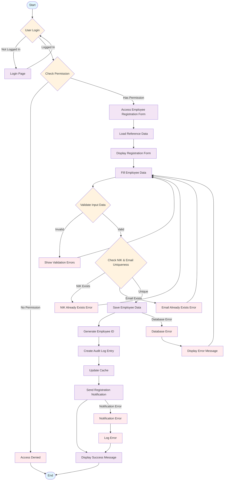
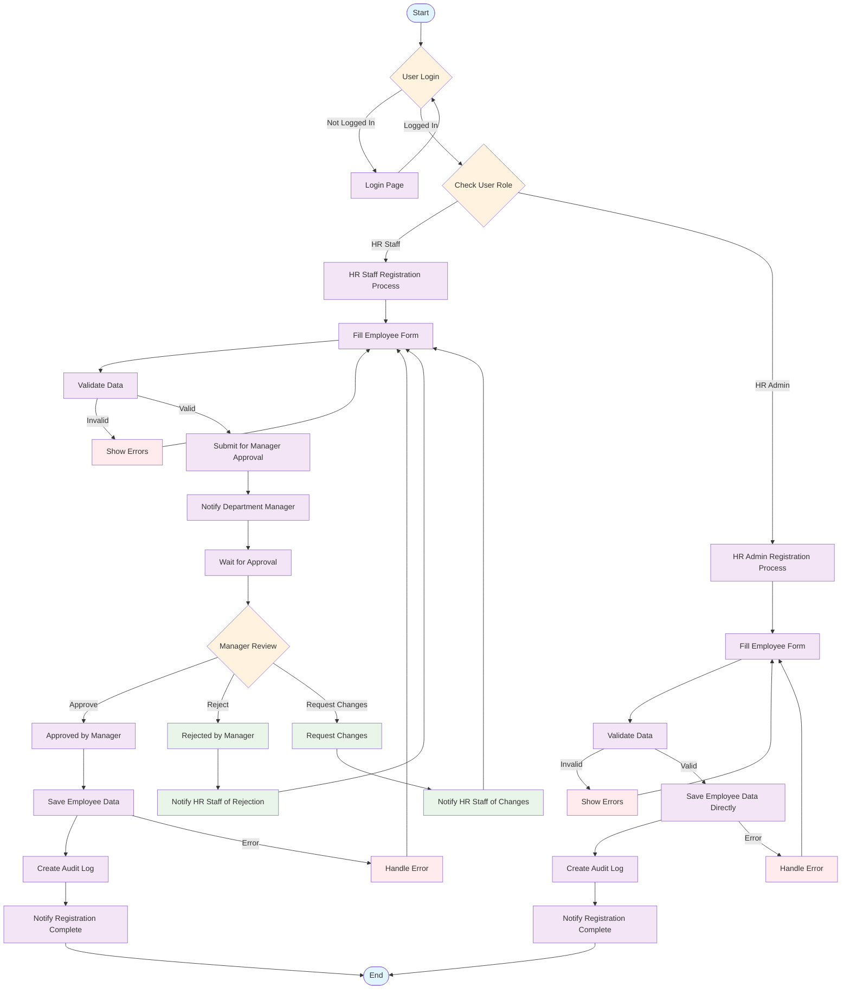
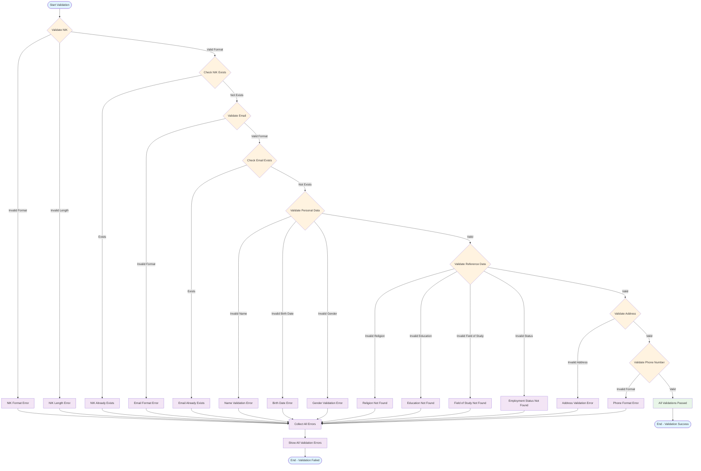
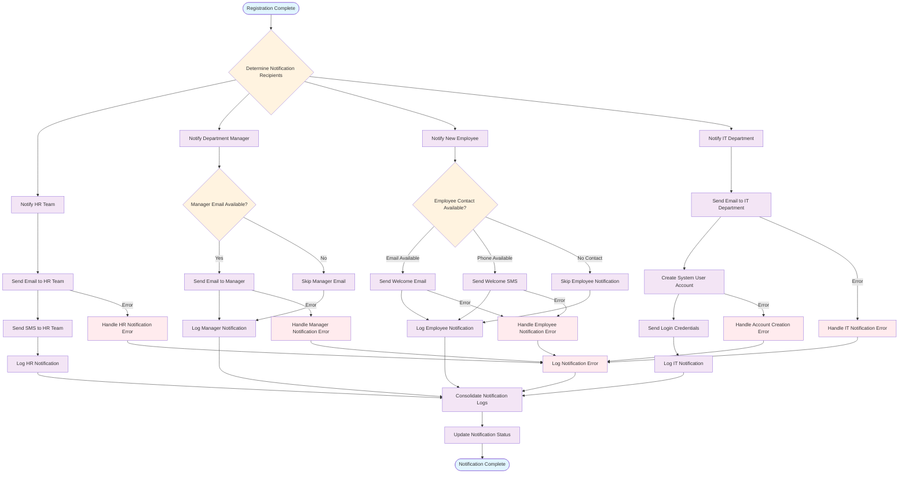
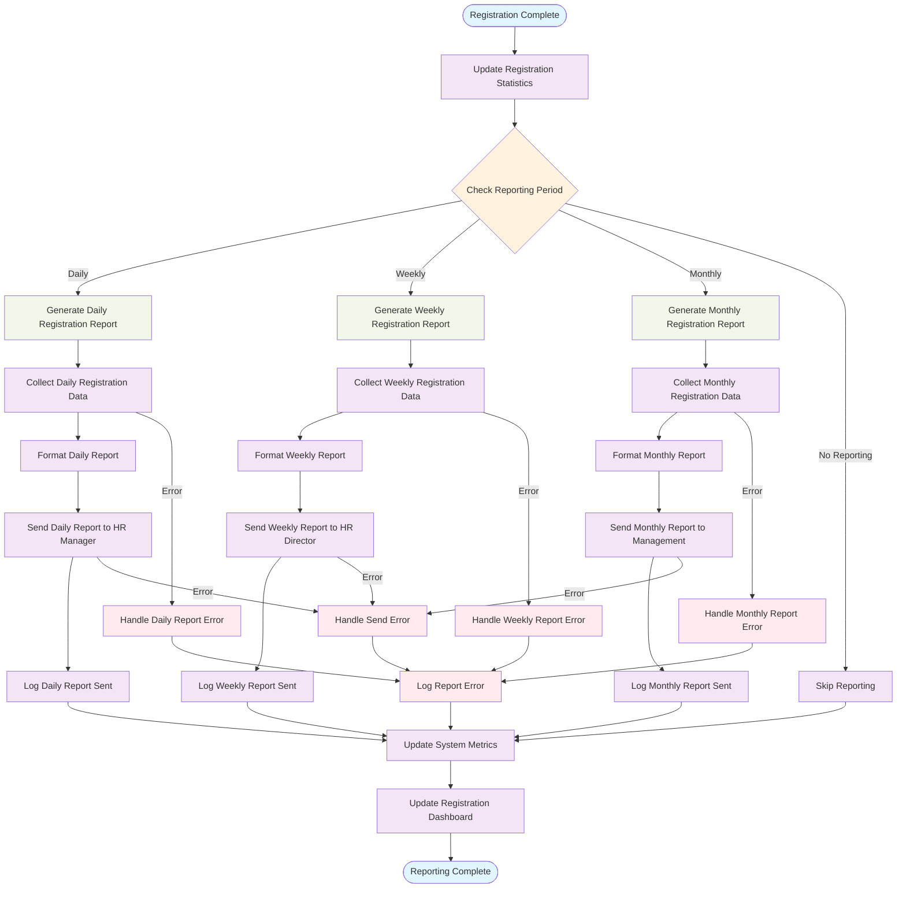

# Activity Diagram - Employee Registration

## 📋 Overview

Dokumen ini berisi Activity Diagram untuk proses registrasi pegawai dalam sistem SIMPEG (Sistem Informasi Manajemen Pegawai) Universitas Islam Negeri Sultan Maulana Hasanuddin.

## 🎯 Activity Diagram: Employee Registration Process

### Complete Employee Registration Flow

## 🔄 Activity Diagram: Employee Registration with Approval Workflow

### Employee Registration with Manager Approval

## 📝 Activity Diagram: Employee Registration Data Validation

### Detailed Data Validation Process

## 🔔 Activity Diagram: Employee Registration Notification Workflow

### Notification Process for Employee Registration

## 📊 Activity Diagram: Employee Registration Reporting

### Registration Statistics and Reporting

## 🎯 Key Process Steps

### 1. **Authentication & Authorization**

- User login validation
- Permission checking
- Role-based access control

### 2. **Data Validation**

- Input format validation
- Business rule validation
- Reference data validation
- Uniqueness checking

### 3. **Data Processing**

- Employee data saving
- ID generation
- Audit trail creation
- Cache management

### 4. **Notification System**

- Multi-channel notifications
- Error handling
- Status tracking
- Logging

### 5. **Reporting & Analytics**

- Statistics update
- Report generation
- Dashboard updates
- Error logging

## 🔧 Process Optimization

### 1. **Parallel Processing**

- Reference data loading
- Multiple validation checks
- Notification sending
- Report generation

### 2. **Error Handling**

- Graceful error recovery
- User-friendly error messages
- Comprehensive error logging
- Retry mechanisms

### 3. **Performance Optimization**

- Caching strategies
- Database optimization
- Async processing
- Resource management

### 4. **User Experience**

- Clear validation messages
- Progress indicators
- Confirmation dialogs
- Success feedback

---

**Dokumen ini dibuat**: 2024-01-01  
**Versi**: v1.0.0  
**Status**: Complete
