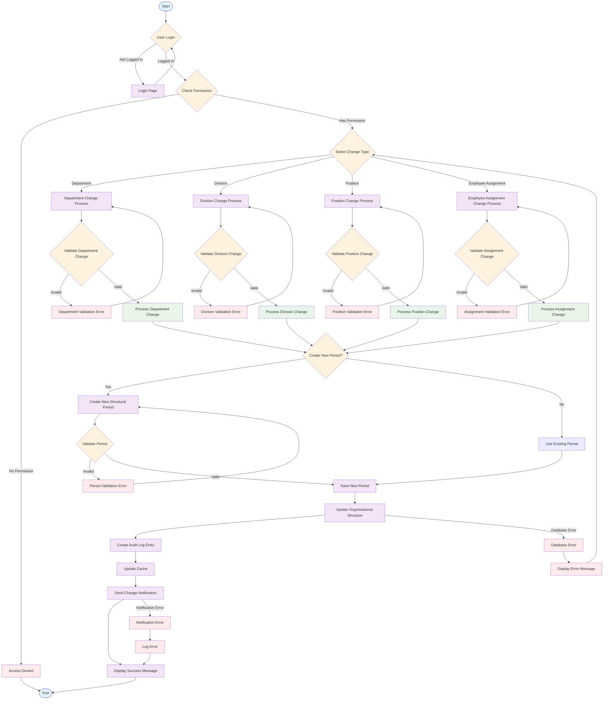
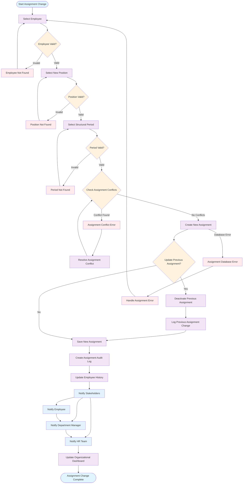
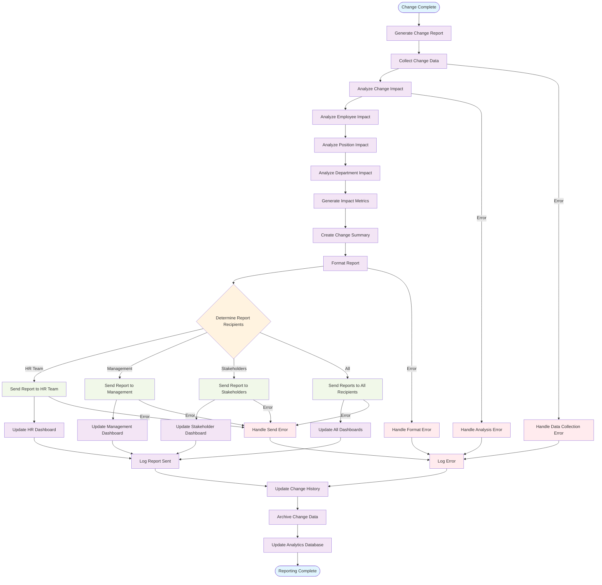
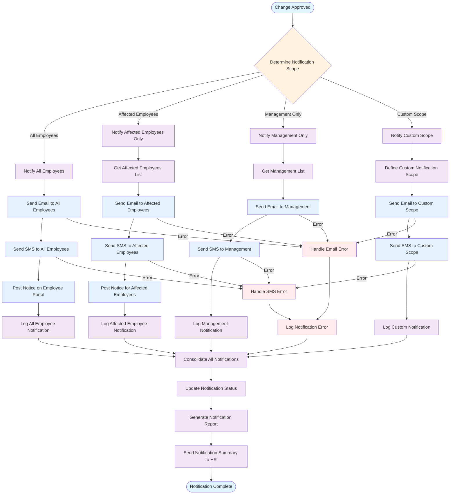

# Activity Diagram - Organizational Change

## 📋 Overview

Dokumen ini berisi Activity Diagram untuk proses perubahan struktur organisasi dalam sistem SIMPEG (Sistem Informasi Manajemen Pegawai) Universitas Islam Negeri Sultan Maulana Hasanuddin.

## 🎯 Activity Diagram: Organizational Structure Change Process

### Complete Organizational Change Flow

## 🔄 Activity Diagram: Employee Assignment Change Process

### Detailed Employee Assignment Change Flow

## 🏢 Activity Diagram: Department Restructuring Process

### Department Restructuring with Approval Workflow

```mermaid
flowchart TD
    Start([Start Department Restructuring]) --> CreateRestructurePlan[Create Restructuring Plan]
    CreateRestructurePlan --> DefineChanges[Define Department Changes]
    DefineChanges --> ImpactAnalysis[Perform Impact Analysis]

    ImpactAnalysis --> AnalyzeEmployees[Analyze Affected Employees]
    AnalyzeEmployees --> AnalyzePositions[Analyze Affected Positions]
    AnalyzePositions --> AnalyzeDivisions[Analyze Affected Divisions]
    AnalyzeDivisions --> GenerateImpactReport[Generate Impact Report]

    GenerateImpactReport --> SubmitForApproval[Submit for Approval]
    SubmitForApproval --> NotifyApprovers[Notify Approvers]
    NotifyApprovers --> WaitApproval[Wait for Approval]

    WaitApproval --> CheckApproval{Approval Status}
    CheckApproval -->|Pending| WaitApproval
    CheckApproval -->|Rejected| HandleRejection[Handle Rejection]
    CheckApproval -->|Approved| ExecuteRestructure[Execute Restructuring]

    HandleRejection --> NotifyRejection[Notify Plan Creator]
    NotifyRejection --> RevisePlan[Revise Restructuring Plan]
    RevisePlan --> CreateRestructurePlan

    ExecuteRestructure --> CreateNewPeriod[Create New Structural Period]
    CreateNewPeriod --> UpdateDepartments[Update Department Structure]
    UpdateDepartments --> UpdateDivisions[Update Division Structure]
    UpdateDivisions --> UpdatePositions[Update Position Structure]
    UpdatePositions --> ReassignEmployees[Reassign Affected Employees]

    ReassignEmployees --> ValidateAssignments{Validate All Assignments}
    ValidateAssignments -->|Invalid| FixAssignments[Fix Invalid Assignments]
    FixAssignments --> ValidateAssignments
    ValidateAssignments -->|Valid| CreateAuditTrail[Create Complete Audit Trail]

    CreateAuditTrail --> NotifyAllStakeholders[Notify All Stakeholders]
    NotifyAllStakeholders --> NotifyAffectedEmployees[Notify Affected Employees]
    NotifyAffectedEmployees --> NotifyDepartmentManagers[Notify Department Managers]
    NotifyDepartmentManagers --> NotifyHRTeam[Notify HR Team]
    NotifyHRTeam --> NotifyManagement[Notify Senior Management]

    NotifyManagement --> UpdateSystem[Update System Configuration]
    UpdateSystem --> UpdateReports[Update Reporting Structure]
    UpdateReports --> UpdateDashboard[Update Organizational Dashboard]
    UpdateDashboard --> End([Restructuring Complete])

    %% Error Handling
    ExecuteRestructure -->|Error| HandleRestructureError[Handle Restructuring Error]
    HandleRestructureError --> RollbackChanges[Rollback Changes]
    RollbackChanges --> NotifyError[Notify Error to Stakeholders]
    NotifyError --> End

    %% Styling
    classDef startEnd fill:#e1f5fe
    classDef process fill:#f3e5f5
    classDef decision fill:#fff3e0
    classDef error fill:#ffebee
    classDef approval fill:#e8f5e8
    classDef notification fill:#e3f2fd

    class Start,End startEnd
    class CreateRestructurePlan,DefineChanges,ImpactAnalysis,AnalyzeEmployees,AnalyzePositions,AnalyzeDivisions,GenerateImpactReport,SubmitForApproval,NotifyApprovers,WaitApproval,ExecuteRestructure,CreateNewPeriod,UpdateDepartments,UpdateDivisions,UpdatePositions,ReassignEmployees,CreateAuditTrail,UpdateSystem,UpdateReports,UpdateDashboard process
    class CheckApproval,ValidateAssignments decision
    class HandleRejection,NotifyRejection,RevisePlan,FixAssignments approval
    class NotifyAllStakeholders,NotifyAffectedEmployees,NotifyDepartmentManagers,NotifyHRTeam,NotifyManagement notification
    class HandleRestructureError,RollbackChanges,NotifyError error
```

## 📊 Activity Diagram: Organizational Change Reporting

### Change Impact Reporting and Analytics

## 🔔 Activity Diagram: Organizational Change Notification

### Comprehensive Notification System for Organizational Changes

## 🎯 Key Process Steps

### 1. **Change Initiation**

- User authentication and authorization
- Change type selection
- Impact assessment
- Approval workflow

### 2. **Validation & Conflict Resolution**

- Data validation
- Conflict detection
- Conflict resolution
- Business rule validation

### 3. **Change Execution**

- Structural period management
- Database updates
- Audit trail creation
- Cache management

### 4. **Notification & Communication**

- Multi-channel notifications
- Stakeholder communication
- Status updates
- Error handling

### 5. **Reporting & Analytics**

- Impact analysis
- Change reporting
- Dashboard updates
- Historical tracking

## 🔧 Process Optimization

### 1. **Parallel Processing**

- Multiple change validations
- Concurrent notifications
- Parallel report generation
- Async processing

### 2. **Error Handling**

- Graceful error recovery
- Rollback mechanisms
- Error logging
- User feedback

### 3. **Performance Optimization**

- Caching strategies
- Database optimization
- Batch processing
- Resource management

### 4. **User Experience**

- Clear change workflows
- Progress indicators
- Confirmation dialogs
- Success feedback

---

**Dokumen ini dibuat**: 2024-01-01  
**Versi**: v1.0.0  
**Status**: Complete
