# Class Diagram - Employee Domain

## 📋 Overview

Dokumen ini berisi Class Diagram untuk domain Employee dalam sistem SIMPEG (Sistem Informasi Manajemen Pegawai) Universitas Islam Negeri Sultan Maulana Hasanuddin.

## 🏗️ Class Diagram: Employee Domain

### Complete Employee Domain Class Structure

```mermaid
classDiagram
    %% Employee Entity
    class Employee {
        -String id
        -String id_sp
        -String nik
        -String nidn
        -String nama
        -String tempatLahir
        -Date tanggalLahir
        -String jenisKelamin
        -String gelarDepan
        -String gelarBelakang
        -BigInteger bidangIlmu_id
        -BigInteger pendidikan_id
        -String ektp
        -String nokk
        -String alamatKtp
        -String alamat
        -BigInteger agama_id
        -BigInteger status_id
        -String noWa
        -String email
        -BigInteger ikatanKerja_id
        -BigInteger aktivitas_id
        -String foto
        -Date tanggalMasukKerja
        -String peran
        -String tugasUtama
        -String serdos
        -BigInteger jafung
        -Timestamp created_at
        -Timestamp updated_at
        -Timestamp deleted_at

        +getId() String
        +setId(String id) void
        +getNik() String
        +setNik(String nik) void
        +getNama() String
        +setNama(String nama) void
        +getEmail() String
        +setEmail(String email) void
        +isActive() boolean
        +softDelete() void
        +restore() void
        +validate() ValidationResult
        +toArray() Map
    }

    %% Employee Repository Interface
    class EmployeeRepositoryInterface {
        <<interface>>
        +findById(String id) Employee
        +findByNik(String nik) Employee
        +findByEmail(String email) Employee
        +findAll() Collection~Employee~
        +findActive() Collection~Employee~
        +findDeleted() Collection~Employee~
        +search(String criteria) Collection~Employee~
        +save(Employee employee) Employee
        +update(Employee employee) Employee
        +delete(String id) boolean
        +softDelete(String id) boolean
        +restore(String id) boolean
        +existsByNik(String nik) boolean
        +existsByEmail(String email) boolean
        +count() long
        +countActive() long
        +countDeleted() long
    }

    %% Employee Repository Implementation
    class EmployeeRepository {
        -EntityManager entityManager
        -EmployeeRepositoryInterface repository

        +findById(String id) Employee
        +findByNik(String nik) Employee
        +findByEmail(String email) Employee
        +findAll() Collection~Employee~
        +findActive() Collection~Employee~
        +findDeleted() Collection~Employee~
        +search(String criteria) Collection~Employee~
        +save(Employee employee) Employee
        +update(Employee employee) Employee
        +delete(String id) boolean
        +softDelete(String id) boolean
        +restore(String id) boolean
        +existsByNik(String nik) boolean
        +existsByEmail(String email) boolean
        +count() long
        +countActive() long
        +countDeleted() long
        -buildSearchQuery(String criteria) Query
        -mapToEntity(ResultSet rs) Employee
    }

    %% Employee Service Interface
    class EmployeeServiceInterface {
        <<interface>>
        +createEmployee(CreateEmployeeRequest request) Employee
        +updateEmployee(String id, UpdateEmployeeRequest request) Employee
        +getEmployee(String id) Employee
        +getEmployeeByNik(String nik) Employee
        +searchEmployees(SearchEmployeeRequest request) PagedResult~Employee~
        +deleteEmployee(String id) boolean
        +activateEmployee(String id) boolean
        +deactivateEmployee(String id) boolean
        +validateEmployee(Employee employee) ValidationResult
        +exportEmployees(ExportRequest request) ExportResult
        +importEmployees(ImportRequest request) ImportResult
    }

    %% Employee Service Implementation
    class EmployeeService {
        -EmployeeRepositoryInterface employeeRepository
        -EmployeeHistoryServiceInterface historyService
        -ValidationServiceInterface validationService
        -NotificationServiceInterface notificationService
        -CacheServiceInterface cacheService

        +createEmployee(CreateEmployeeRequest request) Employee
        +updateEmployee(String id, UpdateEmployeeRequest request) Employee
        +getEmployee(String id) Employee
        +getEmployeeByNik(String nik) Employee
        +searchEmployees(SearchEmployeeRequest request) PagedResult~Employee~
        +deleteEmployee(String id) boolean
        +activateEmployee(String id) boolean
        +deactivateEmployee(String id) boolean
        +validateEmployee(Employee employee) ValidationResult
        +exportEmployees(ExportRequest request) ExportResult
        +importEmployees(ImportRequest request) ImportResult
        -generateEmployeeId() String
        -validateEmployeeData(Employee employee) ValidationResult
        -createAuditLog(Employee employee, String action) void
        -sendNotification(Employee employee, String event) void
        -updateCache(Employee employee) void
    }

    %% Employee Controller
    class EmployeeController {
        -EmployeeServiceInterface employeeService
        -ValidationServiceInterface validationService

        +createEmployee(CreateEmployeeRequest request) ResponseEntity~Employee~
        +updateEmployee(String id, UpdateEmployeeRequest request) ResponseEntity~Employee~
        +getEmployee(String id) ResponseEntity~Employee~
        +getEmployeeByNik(String nik) ResponseEntity~Employee~
        +searchEmployees(SearchEmployeeRequest request) ResponseEntity~PagedResult~Employee~~
        +deleteEmployee(String id) ResponseEntity~Boolean~
        +activateEmployee(String id) ResponseEntity~Boolean~
        +deactivateEmployee(String id) ResponseEntity~Boolean~
        +exportEmployees(ExportRequest request) ResponseEntity~ExportResult~
        +importEmployees(ImportRequest request) ResponseEntity~ImportResult~
        -handleValidationError(ValidationResult result) ResponseEntity~ErrorResponse~
        -handleException(Exception ex) ResponseEntity~ErrorResponse~
    }

    %% Request/Response DTOs
    class CreateEmployeeRequest {
        -String id_sp
        -String nik
        -String nidn
        -String nama
        -String tempatLahir
        -Date tanggalLahir
        -String jenisKelamin
        -String gelarDepan
        -String gelarBelakang
        -BigInteger bidangIlmu_id
        -BigInteger pendidikan_id
        -String ektp
        -String nokk
        -String alamatKtp
        -String alamat
        -BigInteger agama_id
        -BigInteger status_id
        -String noWa
        -String email
        -BigInteger ikatanKerja_id
        -BigInteger aktivitas_id
        -String foto
        -Date tanggalMasukKerja
        -String peran
        -String tugasUtama
        -String serdos
        -BigInteger jafung

        +validate() ValidationResult
        +toEmployee() Employee
    }

    class UpdateEmployeeRequest {
        -String nama
        -String tempatLahir
        -Date tanggalLahir
        -String jenisKelamin
        -String gelarDepan
        -String gelarBelakang
        -BigInteger bidangIlmu_id
        -BigInteger pendidikan_id
        -String ektp
        -String nokk
        -String alamatKtp
        -String alamat
        -BigInteger agama_id
        -BigInteger status_id
        -String noWa
        -String email
        -BigInteger ikatanKerja_id
        -BigInteger aktivitas_id
        -String foto
        -Date tanggalMasukKerja
        -String peran
        -String tugasUtama
        -String serdos
        -BigInteger jafung

        +validate() ValidationResult
        +applyToEmployee(Employee employee) void
    }

    class SearchEmployeeRequest {
        -String search
        -String nik
        -String nama
        -String email
        -BigInteger agama_id
        -BigInteger status_id
        -BigInteger departement_id
        -BigInteger division_id
        -BigInteger position_id
        -String jenisKelamin
        -Date tanggalLahirFrom
        -Date tanggalLahirTo
        -Date tanggalMasukKerjaFrom
        -Date tanggalMasukKerjaTo
        -Boolean isActive
        -String sortBy
        -String sortDirection
        -Integer page
        -Integer size

        +validate() ValidationResult
        +toSearchCriteria() SearchCriteria
    }

    class EmployeeResponse {
        -String id
        -String id_sp
        -String nik
        -String nidn
        -String nama
        -String tempatLahir
        -Date tanggalLahir
        -String jenisKelamin
        -String gelarDepan
        -String gelarBelakang
        -String bidangIlmu
        -String pendidikan
        -String ektp
        -String nokk
        -String alamatKtp
        -String alamat
        -String agama
        -String status
        -String noWa
        -String email
        -String ikatanKerja
        -String aktivitas
        -String foto
        -Date tanggalMasukKerja
        -String peran
        -String tugasUtama
        -String serdos
        -String jafung
        -Timestamp created_at
        -Timestamp updated_at
        -Boolean isActive

        +fromEmployee(Employee employee) EmployeeResponse
        +toJson() String
    }

    %% Validation Classes
    class ValidationResult {
        -Boolean isValid
        -List~String~ errors
        -List~String~ warnings

        +isValid() boolean
        +getErrors() List~String~
        +getWarnings() List~String~
        +addError(String error) void
        +addWarning(String warning) void
        +hasErrors() boolean
        +hasWarnings() boolean
    }

    class EmployeeValidator {
        -ValidationServiceInterface validationService

        +validateEmployee(Employee employee) ValidationResult
        +validateCreateRequest(CreateEmployeeRequest request) ValidationResult
        +validateUpdateRequest(UpdateEmployeeRequest request) ValidationResult
        +validateSearchRequest(SearchEmployeeRequest request) ValidationResult
        -validateNik(String nik) ValidationResult
        -validateEmail(String email) ValidationResult
        -validatePersonalData(Employee employee) ValidationResult
        -validateReferenceData(Employee employee) ValidationResult
    }

    %% Relationships
    EmployeeController --> EmployeeServiceInterface : uses
    EmployeeService --> EmployeeRepositoryInterface : uses
    EmployeeService --> EmployeeHistoryServiceInterface : uses
    EmployeeService --> ValidationServiceInterface : uses
    EmployeeService --> NotificationServiceInterface : uses
    EmployeeService --> CacheServiceInterface : uses
    EmployeeRepository --> EmployeeRepositoryInterface : implements
    EmployeeRepository --> Employee : manages
    EmployeeValidator --> ValidationServiceInterface : uses

    EmployeeController --> CreateEmployeeRequest : receives
    EmployeeController --> UpdateEmployeeRequest : receives
    EmployeeController --> SearchEmployeeRequest : receives
    EmployeeController --> EmployeeResponse : returns

    CreateEmployeeRequest --> Employee : converts to
    UpdateEmployeeRequest --> Employee : updates
    SearchEmployeeRequest --> SearchCriteria : converts to
    Employee --> EmployeeResponse : converts to

    EmployeeValidator --> ValidationResult : returns
    EmployeeValidator --> CreateEmployeeRequest : validates
    EmployeeValidator --> UpdateEmployeeRequest : validates
    EmployeeValidator --> SearchEmployeeRequest : validates
    EmployeeValidator --> Employee : validates
```



## 🔧 Class Diagram: Employee Domain with Reference Entities

### Employee Domain with Reference Relationships

```mermaid
classDiagram
    %% Employee Entity
    class Employee {
        -String id
        -String nik
        -String nama
        -String email
        -BigInteger agama_id
        -BigInteger pendidikan_id
        -BigInteger bidangIlmu_id
        -BigInteger status_id
        -BigInteger ikatanKerja_id
        -BigInteger aktivitas_id
        -BigInteger jafung
        -Timestamp created_at
        -Timestamp updated_at
        -Timestamp deleted_at

        +getAgama() Religion
        +getPendidikan() Education
        +getBidangIlmu() FieldOfStudy
        +getStatus() EmploymentStatus
        +getIkatanKerja() EmploymentType
        +getAktivitas() Activity
        +getJabfung() Jabfung
        +getStructurals() Collection~Structural~
        +getHistories() Collection~EmployeeHistory~
    }

    %% Reference Entities
    class Religion {
        -BigInteger id
        -String nama
        -Boolean isActive
        -Timestamp created_at
        -Timestamp updated_at
        -Timestamp deleted_at

        +getId() BigInteger
        +getNama() String
        +isActive() boolean
        +getEmployees() Collection~Employee~
    }

    class Education {
        -BigInteger id
        -String tingkat
        -String nama
        -Boolean isActive
        -Timestamp created_at
        -Timestamp updated_at
        -Timestamp deleted_at

        +getId() BigInteger
        +getTingkat() String
        +getNama() String
        +isActive() boolean
        +getEmployees() Collection~Employee~
    }

    class FieldOfStudy {
        -BigInteger id
        -String nama
        -String kode
        -Boolean isActive
        -Timestamp created_at
        -Timestamp updated_at
        -Timestamp deleted_at

        +getId() BigInteger
        +getNama() String
        +getKode() String
        +isActive() boolean
        +getEmployees() Collection~Employee~
    }

    class EmploymentStatus {
        -BigInteger id
        -String nama
        -String deskripsi
        -Boolean isActive
        -Timestamp created_at
        -Timestamp updated_at
        -Timestamp deleted_at

        +getId() BigInteger
        +getNama() String
        +getDeskripsi() String
        +isActive() boolean
        +getEmployees() Collection~Employee~
    }

    class EmploymentType {
        -BigInteger id
        -String nama
        -String deskripsi
        -Boolean isActive
        -Timestamp created_at
        -Timestamp updated_at
        -Timestamp deleted_at

        +getId() BigInteger
        +getNama() String
        +getDeskripsi() String
        +isActive() boolean
        +getEmployees() Collection~Employee~
    }

    class Activity {
        -BigInteger id
        -String nama
        -String deskripsi
        -Boolean isActive
        -Timestamp created_at
        -Timestamp updated_at
        -Timestamp deleted_at

        +getId() BigInteger
        +getNama() String
        +getDeskripsi() String
        +isActive() boolean
        +getEmployees() Collection~Employee~
    }

    class Jabfung {
        -BigInteger id
        -String jabfung
        -String subJabfung
        -Integer angkaKreditMinimum
        -Timestamp created_at
        -Timestamp updated_at
        -Timestamp deleted_at

        +getId() BigInteger
        +getJabfung() String
        +getSubJabfung() String
        +getAngkaKreditMinimum() Integer
        +getEmployees() Collection~Employee~
    }

    %% Structural Entity
    class Structural {
        -String id
        -BigInteger structural_period_id
        -BigInteger departement_id
        -BigInteger division_id
        -BigInteger position_id
        -String employee_nik
        -Timestamp created_at
        -Timestamp updated_at
        -Timestamp deleted_at

        +getId() String
        +getEmployee() Employee
        +getDepartement() Departement
        +getDivision() Division
        +getPosition() Position
        +getStructuralPeriod() StructuralPeriod
    }

    %% Employee History Entity
    class EmployeeHistory {
        -BigInteger id
        -String employee_nik
        -String field_name
        -String old_value
        -String new_value
        -String changed_by
        -Timestamp changed_at

        +getId() BigInteger
        +getEmployee() Employee
        +getFieldName() String
        +getOldValue() String
        +getNewValue() String
        +getChangedBy() String
        +getChangedAt() Timestamp
    }

    %% Relationships
    Employee ||--o{ Structural : has
    Employee ||--o{ EmployeeHistory : has
    Employee }o--|| Religion : belongs to
    Employee }o--|| Education : belongs to
    Employee }o--|| FieldOfStudy : belongs to
    Employee }o--|| EmploymentStatus : belongs to
    Employee }o--|| EmploymentType : belongs to
    Employee }o--|| Activity : belongs to
    Employee }o--|| Jabfung : belongs to

    Religion ||--o{ Employee : has
    Education ||--o{ Employee : has
    FieldOfStudy ||--o{ Employee : has
    EmploymentStatus ||--o{ Employee : has
    EmploymentType ||--o{ Employee : has
    Activity ||--o{ Employee : has
    Jabfung ||--o{ Employee : has
```

## 🎯 Key Design Patterns

### 1. **Repository Pattern**

- **EmployeeRepositoryInterface**: Abstract data access
- **EmployeeRepository**: Concrete implementation
- **Separation of Concerns**: Business logic separated from data access

### 2. **Service Layer Pattern**

- **EmployeeServiceInterface**: Business logic abstraction
- **EmployeeService**: Business logic implementation
- **Transaction Management**: Service layer handles transactions

### 3. **DTO Pattern**

- **Request DTOs**: Input data transfer objects
- **Response DTOs**: Output data transfer objects
- **Data Transformation**: Clean separation between internal and external data

### 4. **Validation Pattern**

- **ValidationResult**: Centralized validation result
- **EmployeeValidator**: Dedicated validation logic
- **Input Sanitization**: All inputs validated before processing

### 5. **Audit Pattern**

- **EmployeeHistory**: Audit trail for changes
- **Automatic Logging**: All changes automatically logged
- **Change Tracking**: Complete change history maintained

## 🔧 Class Responsibilities

### 1. **Employee Entity**

- **Data Storage**: Core employee data
- **Business Rules**: Employee-specific business logic
- **Validation**: Basic data validation
- **Relationships**: Reference to related entities

### 2. **EmployeeService**

- **Business Logic**: Core business operations
- **Transaction Management**: Database transaction handling
- **Integration**: Coordination with other services
- **Error Handling**: Business error management

### 3. **EmployeeController**

- **HTTP Handling**: REST API endpoints
- **Request Processing**: Input validation and processing
- **Response Generation**: HTTP response creation
- **Error Handling**: HTTP error responses

### 4. **EmployeeRepository**

- **Data Access**: Database operations
- **Query Building**: Dynamic query construction
- **Performance**: Query optimization
- **Caching**: Data caching strategies

### 5. **EmployeeValidator**

- **Input Validation**: Request validation
- **Business Rules**: Business rule validation
- **Data Integrity**: Data consistency checks
- **Error Reporting**: Validation error reporting

---

**Dokumen ini dibuat**: 2024-01-01  
**Versi**: v1.0.0  
**Status**: Complete
