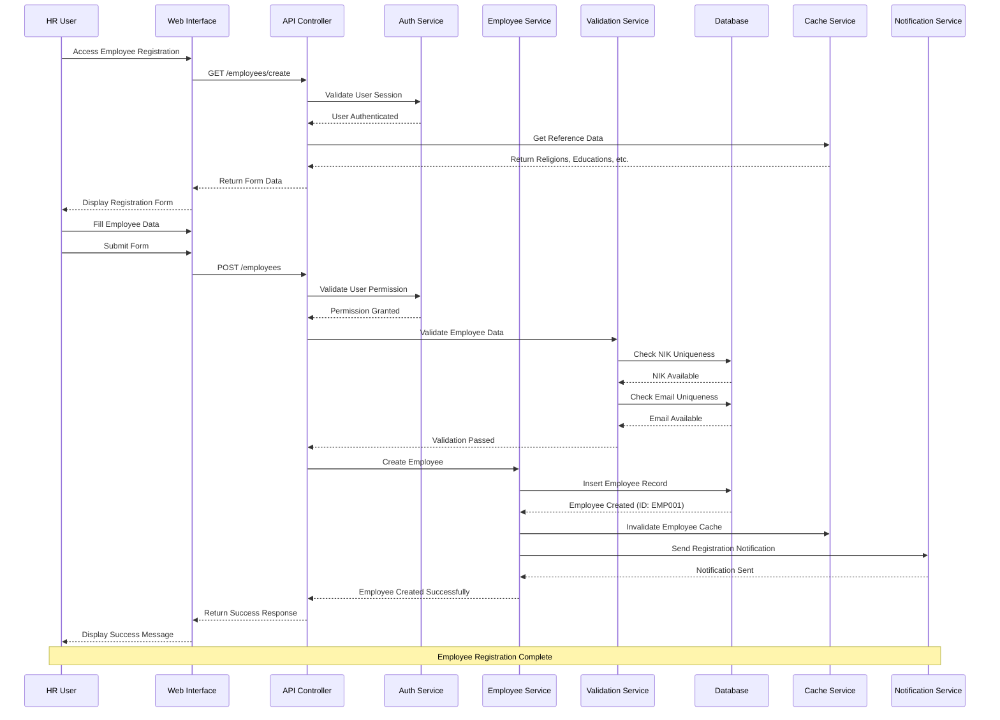
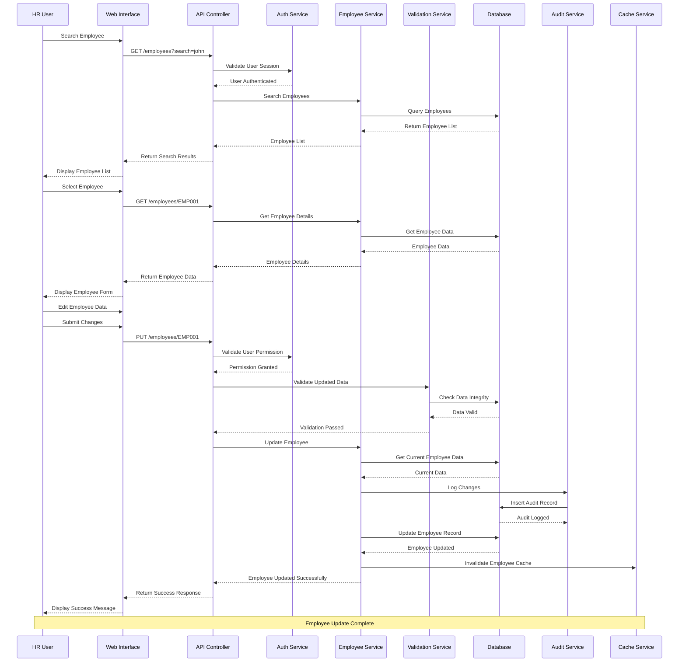
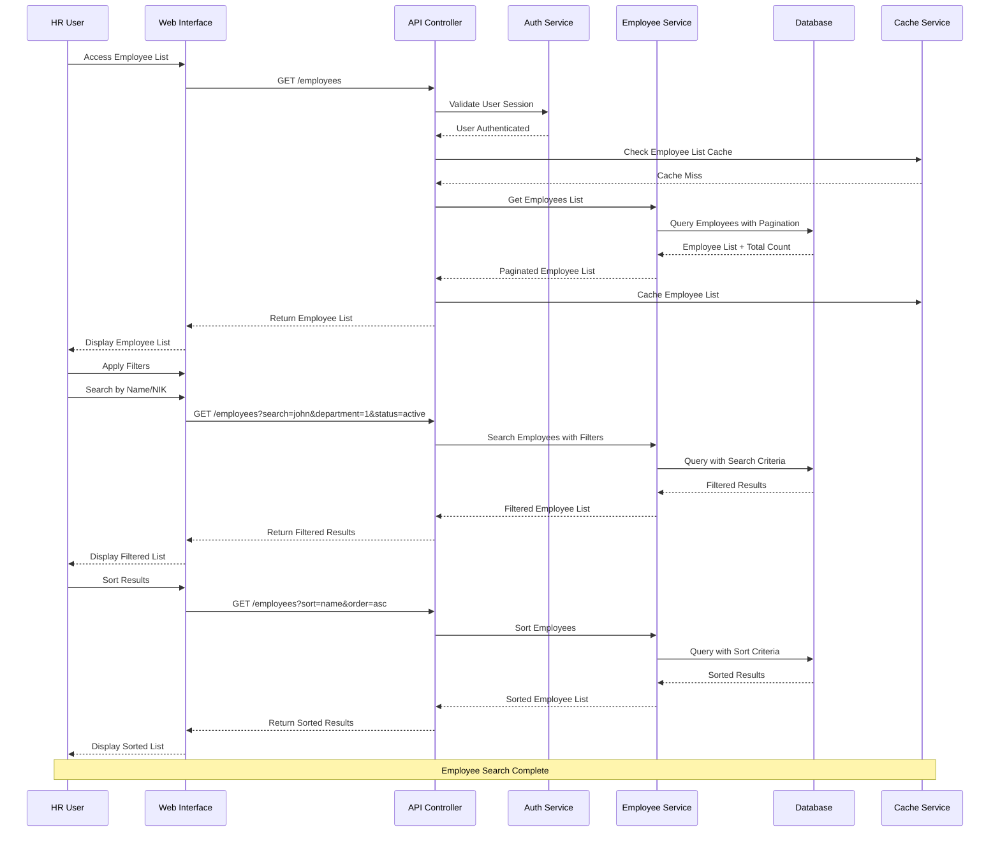
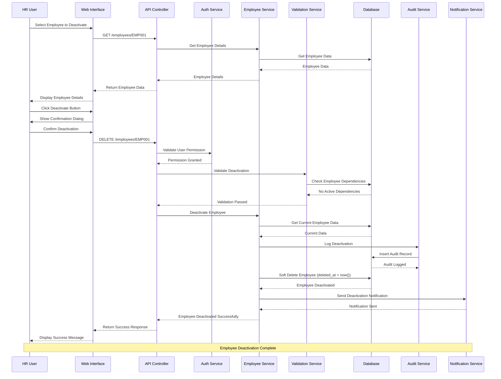
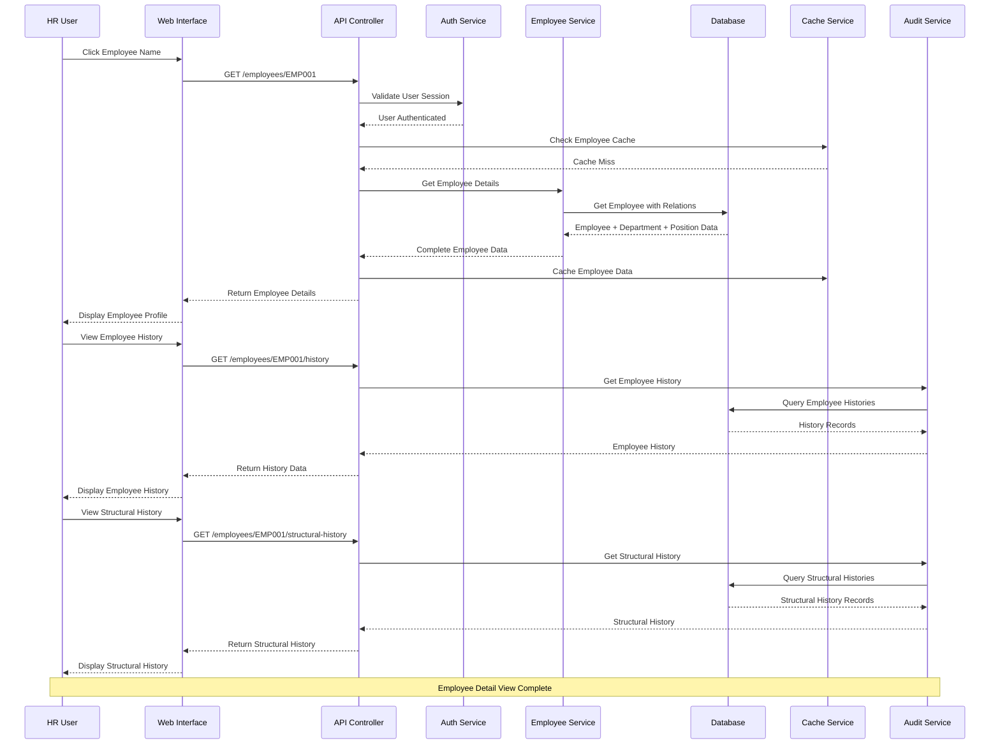
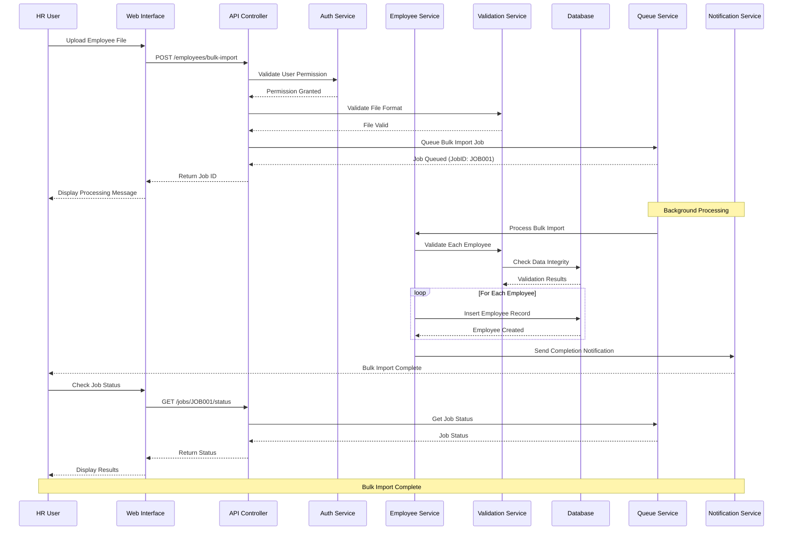
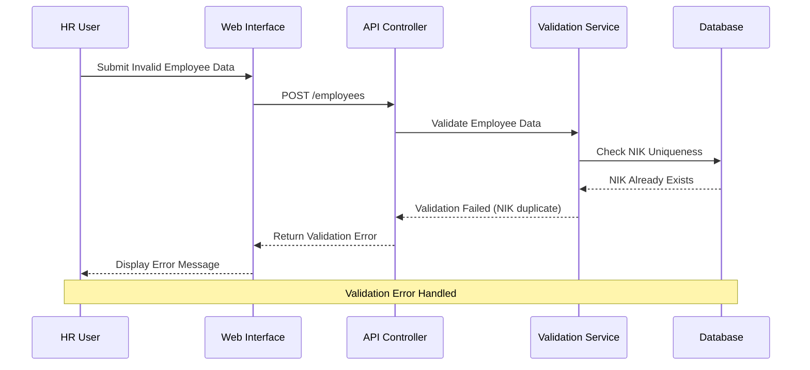
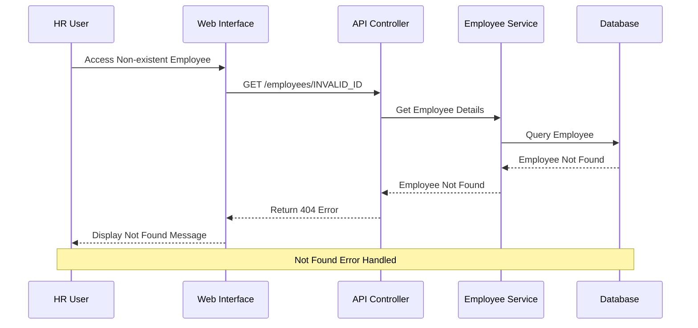

# Sequence Diagram - Employee Management

## 📋 Overview

Dokumen ini berisi sequence diagrams untuk alur manajemen pegawai dalam sistem SIMPEG (Sistem Informasi Manajemen Pegawai) Universitas Islam Negeri Sultan Maulana Hasanuddin.

## 🔄 Employee Registration Flow

### Sequence Diagram: Employee Registration

### Sequence Diagram: Employee Update

### Sequence Diagram: Employee Search and Filter

### Sequence Diagram: Employee Deactivation

## 🔍 Employee Detail View Flow

### Sequence Diagram: View Employee Details

## 📊 Bulk Operations Flow

### Sequence Diagram: Bulk Employee Import

## 🔧 Error Handling Flows

### Sequence Diagram: Employee Validation Error

### Sequence Diagram: Employee Not Found Error

## 🎯 Key Interactions

### 1. Authentication Flow

- Setiap request memerlukan validasi session
- Permission check untuk operasi yang memerlukan authorization
- JWT token validation untuk API requests

### 2. Data Validation Flow

- Input validation sebelum processing
- Database constraint validation
- Business rule validation
- Reference data validation

### 3. Audit Trail Flow

- Log semua perubahan data
- Capture old dan new values
- Track user yang melakukan perubahan
- Timestamp semua activities

### 4. Cache Management Flow

- Cache employee data untuk performance
- Invalidate cache saat data berubah
- Cache reference data
- Cache search results

### 5. Notification Flow

- Send notification untuk important events
- Email notification untuk user
- System notification untuk administrators
- Real-time notification untuk critical events

## 📋 Sequence Diagram Best Practices

### 1. Message Naming

- Use clear, descriptive message names
- Include HTTP methods untuk API calls
- Specify data types dan parameters
- Use consistent naming conventions

### 2. Error Handling

- Include error scenarios dalam diagrams
- Show error messages dan responses
- Display error recovery flows
- Handle timeout scenarios

### 3. Performance Considerations

- Show caching mechanisms
- Include pagination untuk large datasets
- Display background processing
- Show optimization techniques

### 4. Security Considerations

- Include authentication flows
- Show authorization checks
- Display permission validations
- Include audit logging

---

**Dokumen ini dibuat**: 2024-01-01  
**Versi**: v1.0.0  
**Status**: Complete
