# Use Case Diagram - SIMPEG UNISM

## 📋 Overview

Dokumen ini berisi Use Case Diagram untuk sistem SIMPEG (Sistem Informasi Manajemen Pegawai) Universitas Islam Negeri Sultan Maulana Hasanuddin.

## 🎭 Use Case Diagram

### Complete System Use Case Diagram

```mermaid
graph TB
    %% Actors
    HR_Admin[HR Administrator]
    HR_Staff[HR Staff]
    Dept_Manager[Department Manager]
    Employee[Employee]
    System[External Systems]

    %% System Boundary
    subgraph SIMPEG_System[SIMPEG System]
        %% Employee Management
        UC1[Register Employee]
        UC2[Update Employee Data]
        UC3[Search Employees]
        UC4[View Employee Details]
        UC5[Deactivate Employee]
        UC6[Bulk Employee Operations]

        %% Organizational Structure
        UC7[Manage Departments]
        UC8[Manage Divisions]
        UC9[Manage Positions]
        UC10[Assign Employee to Structure]
        UC11[View Organizational Chart]
        UC12[Manage Structural Periods]

        %% Reference Data
        UC13[Manage Religions]
        UC14[Manage Educations]
        UC15[Manage Fields of Study]
        UC16[Manage Employment Status]
        UC17[Manage Employment Types]
        UC18[Manage Activities]
        UC19[Manage Jabatan Fungsional]

        %% Reports
        UC20[Generate Employee Summary Report]
        UC21[Generate Organizational Report]
        UC22[Generate Employee Statistics]
        UC23[Generate Custom Reports]
        UC24[Export Reports]

        %% Audit Trail
        UC25[View Employee History]
        UC26[View Structural History]
        UC27[Generate Audit Reports]
        UC28[View System Logs]

        %% Authentication
        UC29[Login to System]
        UC30[Logout from System]
        UC31[Reset Password]
        UC32[Manage User Sessions]

        %% System Configuration
        UC33[Configure System Settings]
        UC34[Manage User Roles]
        UC35[Manage Permissions]
        UC36[System Maintenance]

        %% Integration
        UC37[Sync with Sister API]
        UC38[Manage Data Cache]
        UC39[Handle External Errors]
    end

    %% HR Administrator Relationships
    HR_Admin --> UC1
    HR_Admin --> UC2
    HR_Admin --> UC3
    HR_Admin --> UC4
    HR_Admin --> UC5
    HR_Admin --> UC6
    HR_Admin --> UC7
    HR_Admin --> UC8
    HR_Admin --> UC9
    HR_Admin --> UC10
    HR_Admin --> UC11
    HR_Admin --> UC12
    HR_Admin --> UC13
    HR_Admin --> UC14
    HR_Admin --> UC15
    HR_Admin --> UC16
    HR_Admin --> UC17
    HR_Admin --> UC18
    HR_Admin --> UC19
    HR_Admin --> UC20
    HR_Admin --> UC21
    HR_Admin --> UC22
    HR_Admin --> UC23
    HR_Admin --> UC24
    HR_Admin --> UC25
    HR_Admin --> UC26
    HR_Admin --> UC27
    HR_Admin --> UC28
    HR_Admin --> UC29
    HR_Admin --> UC30
    HR_Admin --> UC31
    HR_Admin --> UC32
    HR_Admin --> UC33
    HR_Admin --> UC34
    HR_Admin --> UC35
    HR_Admin --> UC36
    HR_Admin --> UC37
    HR_Admin --> UC38
    HR_Admin --> UC39

    %% HR Staff Relationships
    HR_Staff --> UC1
    HR_Staff --> UC2
    HR_Staff --> UC3
    HR_Staff --> UC4
    HR_Staff --> UC5
    HR_Staff --> UC6
    HR_Staff --> UC7
    HR_Staff --> UC8
    HR_Staff --> UC9
    HR_Staff --> UC10
    HR_Staff --> UC11
    HR_Staff --> UC12
    HR_Staff --> UC13
    HR_Staff --> UC14
    HR_Staff --> UC15
    HR_Staff --> UC16
    HR_Staff --> UC17
    HR_Staff --> UC18
    HR_Staff --> UC19
    HR_Staff --> UC20
    HR_Staff --> UC21
    HR_Staff --> UC22
    HR_Staff --> UC23
    HR_Staff --> UC24
    HR_Staff --> UC25
    HR_Staff --> UC26
    HR_Staff --> UC27
    HR_Staff --> UC29
    HR_Staff --> UC30
    HR_Staff --> UC31

    %% Department Manager Relationships
    Dept_Manager --> UC3
    Dept_Manager --> UC4
    Dept_Manager --> UC11
    Dept_Manager --> UC20
    Dept_Manager --> UC21
    Dept_Manager --> UC22
    Dept_Manager --> UC29
    Dept_Manager --> UC30
    Dept_Manager --> UC31

    %% Employee Relationships
    Employee --> UC4
    Employee --> UC11
    Employee --> UC29
    Employee --> UC30
    Employee --> UC31

    %% External Systems Relationships
    System --> UC37
    System --> UC38
    System --> UC39

    %% Include Relationships
    UC1 -.-> UC29
    UC2 -.-> UC29
    UC3 -.-> UC29
    UC4 -.-> UC29
    UC5 -.-> UC29
    UC6 -.-> UC29
    UC7 -.-> UC29
    UC8 -.-> UC29
    UC9 -.-> UC29
    UC10 -.-> UC29
    UC11 -.-> UC29
    UC12 -.-> UC29
    UC13 -.-> UC29
    UC14 -.-> UC29
    UC15 -.-> UC29
    UC16 -.-> UC29
    UC17 -.-> UC29
    UC18 -.-> UC29
    UC19 -.-> UC29
    UC20 -.-> UC29
    UC21 -.-> UC29
    UC22 -.-> UC29
    UC23 -.-> UC29
    UC24 -.-> UC29
    UC25 -.-> UC29
    UC26 -.-> UC29
    UC27 -.-> UC29
    UC28 -.-> UC29
    UC33 -.-> UC29
    UC34 -.-> UC29
    UC35 -.-> UC29
    UC36 -.-> UC29

    %% Extend Relationships
    UC2 -.-> UC25
    UC5 -.-> UC25
    UC10 -.-> UC26
    UC20 -.-> UC24
    UC21 -.-> UC24
    UC22 -.-> UC24
    UC23 -.-> UC24
    UC27 -.-> UC24
```

## 👥 Actors

### 1. HR Administrator

**Role**: Full access untuk semua fitur sistem

- **Description**: Administrator HR yang memiliki akses penuh ke semua fitur sistem
- **Responsibilities**:
  - Mengelola data pegawai
  - Mengelola struktur organisasi
  - Mengelola data referensi
  - Generate laporan
  - Mengelola audit trail
  - Konfigurasi sistem
  - Mengelola user roles dan permissions

### 2. HR Staff

**Role**: Limited access untuk operasi sehari-hari

- **Description**: Staff HR yang melakukan operasi sehari-hari
- **Responsibilities**:
  - Mengelola data pegawai
  - Mengelola struktur organisasi
  - Mengelola data referensi
  - Generate laporan
  - Mengakses audit trail (view only)

### 3. Department Manager

**Role**: Access terbatas pada departemennya

- **Description**: Manager departemen yang mengelola pegawai di departemennya
- **Responsibilities**:
  - Melihat data pegawai di departemennya
  - Melihat struktur organisasi departemennya
  - Generate laporan untuk departemennya

### 4. Employee

**Role**: View-only access untuk data pribadi

- **Description**: Pegawai yang dapat melihat data pribadinya
- **Responsibilities**:
  - Melihat data pribadinya
  - Melihat posisinya dalam struktur organisasi

### 5. External Systems

**Role**: System integration

- **Description**: Sistem eksternal yang terintegrasi dengan SIMPEG
- **Responsibilities**:
  - Menyediakan data referensi (API Sister)
  - Sinkronisasi data
  - Error handling

## 🎯 Use Cases

### Employee Management Use Cases

#### UC1: Register Employee

- **Actor**: HR Administrator, HR Staff
- **Description**: Registrasi pegawai baru ke sistem
- **Preconditions**: User sudah login
- **Main Flow**:
  1. User memilih menu "Register Employee"
  2. User mengisi form data pegawai
  3. Sistem validasi data input
  4. Sistem simpan data pegawai
  5. Sistem generate employee ID
  6. Sistem tampilkan konfirmasi
- **Postconditions**: Pegawai baru terdaftar dalam sistem

#### UC2: Update Employee Data

- **Actor**: HR Administrator, HR Staff
- **Description**: Update data pegawai yang sudah ada
- **Preconditions**: Pegawai sudah terdaftar dalam sistem
- **Main Flow**:
  1. User mencari pegawai
  2. User memilih pegawai
  3. User edit data pegawai
  4. Sistem validasi data input
  5. Sistem simpan perubahan
  6. Sistem catat dalam audit trail
- **Postconditions**: Data pegawai terupdate

#### UC3: Search Employees

- **Actor**: HR Administrator, HR Staff, Department Manager
- **Description**: Pencarian pegawai berdasarkan kriteria
- **Preconditions**: User sudah login
- **Main Flow**:
  1. User memilih menu "Search Employees"
  2. User input kriteria pencarian
  3. Sistem tampilkan hasil pencarian
  4. User dapat filter dan sort hasil
- **Postconditions**: Hasil pencarian ditampilkan

#### UC4: View Employee Details

- **Actor**: HR Administrator, HR Staff, Department Manager, Employee
- **Description**: Melihat detail data pegawai
- **Preconditions**: Pegawai sudah terdaftar dalam sistem
- **Main Flow**:
  1. User mencari pegawai
  2. User memilih pegawai
  3. Sistem tampilkan detail pegawai
  4. User dapat melihat riwayat perubahan
- **Postconditions**: Detail pegawai ditampilkan

#### UC5: Deactivate Employee

- **Actor**: HR Administrator, HR Staff
- **Description**: Deaktivasi pegawai dari sistem
- **Preconditions**: Pegawai sudah terdaftar dalam sistem
- **Main Flow**:
  1. User mencari pegawai
  2. User memilih pegawai
  3. User pilih "Deactivate Employee"
  4. User input alasan deaktivasi
  5. Sistem soft delete pegawai
  6. Sistem catat dalam audit trail
- **Postconditions**: Pegawai dideaktivasi

#### UC6: Bulk Employee Operations

- **Actor**: HR Administrator, HR Staff
- **Description**: Operasi massal pada data pegawai
- **Preconditions**: User sudah login
- **Main Flow**:
  1. User memilih menu "Bulk Operations"
  2. User upload file data
  3. Sistem validasi data
  4. Sistem proses data secara batch
  5. Sistem tampilkan hasil operasi
- **Postconditions**: Operasi massal selesai

### Organizational Structure Use Cases

#### UC7: Manage Departments

- **Actor**: HR Administrator, HR Staff
- **Description**: Mengelola data departemen
- **Preconditions**: User sudah login
- **Main Flow**:
  1. User memilih menu "Manage Departments"
  2. User dapat create, read, update, delete departemen
  3. Sistem validasi data
  4. Sistem simpan perubahan
- **Postconditions**: Data departemen terkelola

#### UC8: Manage Divisions

- **Actor**: HR Administrator, HR Staff
- **Description**: Mengelola data divisi
- **Preconditions**: User sudah login
- **Main Flow**:
  1. User memilih menu "Manage Divisions"
  2. User dapat create, read, update, delete divisi
  3. Sistem validasi data dan parent departemen
  4. Sistem simpan perubahan
- **Postconditions**: Data divisi terkelola

#### UC9: Manage Positions

- **Actor**: HR Administrator, HR Staff
- **Description**: Mengelola data posisi/jabatan
- **Preconditions**: User sudah login
- **Main Flow**:
  1. User memilih menu "Manage Positions"
  2. User dapat create, read, update, delete posisi
  3. Sistem validasi data
  4. Sistem simpan perubahan
- **Postconditions**: Data posisi terkelola

#### UC10: Assign Employee to Structure

- **Actor**: HR Administrator, HR Staff
- **Description**: Assignment pegawai ke struktur organisasi
- **Preconditions**: Pegawai dan struktur sudah ada
- **Main Flow**:
  1. User memilih pegawai
  2. User pilih posisi dalam struktur
  3. User pilih periode
  4. Sistem validasi assignment
  5. Sistem simpan assignment
  6. Sistem catat dalam audit trail
- **Postconditions**: Pegawai ter-assign ke struktur

#### UC11: View Organizational Chart

- **Actor**: HR Administrator, HR Staff, Department Manager, Employee
- **Description**: Melihat struktur organisasi dalam bentuk chart
- **Preconditions**: User sudah login
- **Main Flow**:
  1. User memilih menu "Organizational Chart"
  2. User pilih periode
  3. Sistem generate organizational chart
  4. Sistem tampilkan chart interaktif
- **Postconditions**: Organizational chart ditampilkan

#### UC12: Manage Structural Periods

- **Actor**: HR Administrator, HR Staff
- **Description**: Mengelola periode struktur organisasi
- **Preconditions**: User sudah login
- **Main Flow**:
  1. User memilih menu "Manage Structural Periods"
  2. User dapat create, read, update, delete periode
  3. Sistem validasi periode tidak overlap
  4. Sistem simpan perubahan
- **Postconditions**: Periode struktur terkelola

### Reference Data Use Cases

#### UC13-UC19: Manage Reference Data

- **Actor**: HR Administrator, HR Staff
- **Description**: Mengelola data referensi (religions, educations, fields of study, employment status, employment types, activities, jabatan fungsional)
- **Preconditions**: User sudah login
- **Main Flow**:
  1. User memilih menu reference data
  2. User dapat create, read, update, delete data referensi
  3. Sistem validasi data
  4. Sistem simpan perubahan
- **Postconditions**: Data referensi terkelola

### Reports Use Cases

#### UC20: Generate Employee Summary Report

- **Actor**: HR Administrator, HR Staff, Department Manager
- **Description**: Generate laporan ringkasan pegawai
- **Preconditions**: User sudah login
- **Main Flow**:
  1. User memilih menu "Employee Summary Report"
  2. User pilih filter dan parameter
  3. Sistem generate laporan
  4. Sistem tampilkan laporan
- **Postconditions**: Laporan ringkasan pegawai dihasilkan

#### UC21: Generate Organizational Report

- **Actor**: HR Administrator, HR Staff, Department Manager
- **Description**: Generate laporan struktur organisasi
- **Preconditions**: User sudah login
- **Main Flow**:
  1. User memilih menu "Organizational Report"
  2. User pilih periode dan filter
  3. Sistem generate laporan
  4. Sistem tampilkan laporan
- **Postconditions**: Laporan struktur organisasi dihasilkan

#### UC22: Generate Employee Statistics

- **Actor**: HR Administrator, HR Staff, Department Manager
- **Description**: Generate laporan statistik pegawai
- **Preconditions**: User sudah login
- **Main Flow**:
  1. User memilih menu "Employee Statistics"
  2. User pilih parameter statistik
  3. Sistem generate statistik
  4. Sistem tampilkan statistik
- **Postconditions**: Statistik pegawai dihasilkan

#### UC23: Generate Custom Reports

- **Actor**: HR Administrator, HR Staff
- **Description**: Generate laporan custom
- **Preconditions**: User sudah login
- **Main Flow**:
  1. User memilih menu "Custom Reports"
  2. User design laporan custom
  3. User pilih data dan filter
  4. Sistem generate laporan
  5. Sistem tampilkan laporan
- **Postconditions**: Laporan custom dihasilkan

#### UC24: Export Reports

- **Actor**: HR Administrator, HR Staff, Department Manager
- **Description**: Export laporan ke format file
- **Preconditions**: Laporan sudah dihasilkan
- **Main Flow**:
  1. User pilih laporan
  2. User pilih format export (PDF, Excel, CSV)
  3. Sistem generate file
  4. Sistem download file
- **Postconditions**: Laporan di-export ke file

### Audit Trail Use Cases

#### UC25: View Employee History

- **Actor**: HR Administrator, HR Staff
- **Description**: Melihat riwayat perubahan data pegawai
- **Preconditions**: User sudah login
- **Main Flow**:
  1. User memilih pegawai
  2. User pilih menu "Employee History"
  3. Sistem tampilkan riwayat perubahan
  4. User dapat filter dan search riwayat
- **Postconditions**: Riwayat pegawai ditampilkan

#### UC26: View Structural History

- **Actor**: HR Administrator, HR Staff
- **Description**: Melihat riwayat perubahan struktur organisasi
- **Preconditions**: User sudah login
- **Main Flow**:
  1. User pilih menu "Structural History"
  2. User pilih pegawai atau periode
  3. Sistem tampilkan riwayat struktur
  4. User dapat filter dan search riwayat
- **Postconditions**: Riwayat struktur ditampilkan

#### UC27: Generate Audit Reports

- **Actor**: HR Administrator, HR Staff
- **Description**: Generate laporan audit
- **Preconditions**: User sudah login
- **Main Flow**:
  1. User memilih menu "Audit Reports"
  2. User pilih parameter audit
  3. Sistem generate laporan audit
  4. Sistem tampilkan laporan
- **Postconditions**: Laporan audit dihasilkan

#### UC28: View System Logs

- **Actor**: HR Administrator
- **Description**: Melihat system logs
- **Preconditions**: User sudah login sebagai administrator
- **Main Flow**:
  1. User memilih menu "System Logs"
  2. User pilih filter logs
  3. Sistem tampilkan system logs
  4. User dapat search dan filter logs
- **Postconditions**: System logs ditampilkan

### Authentication Use Cases

#### UC29: Login to System

- **Actor**: HR Administrator, HR Staff, Department Manager, Employee
- **Description**: Login ke sistem
- **Preconditions**: User memiliki account
- **Main Flow**:
  1. User input username dan password
  2. Sistem validasi credentials
  3. Sistem generate JWT token
  4. Sistem redirect ke dashboard
- **Postconditions**: User berhasil login

#### UC30: Logout from System

- **Actor**: HR Administrator, HR Staff, Department Manager, Employee
- **Description**: Logout dari sistem
- **Preconditions**: User sudah login
- **Main Flow**:
  1. User klik logout
  2. Sistem invalidate session
  3. Sistem redirect ke login page
- **Postconditions**: User berhasil logout

#### UC31: Reset Password

- **Actor**: HR Administrator, HR Staff, Department Manager, Employee
- **Description**: Reset password user
- **Preconditions**: User memiliki account
- **Main Flow**:
  1. User klik "Forgot Password"
  2. User input email
  3. Sistem kirim reset token
  4. User klik link reset
  5. User input password baru
  6. Sistem update password
- **Postconditions**: Password berhasil direset

#### UC32: Manage User Sessions

- **Actor**: HR Administrator
- **Description**: Mengelola session user
- **Preconditions**: User sudah login sebagai administrator
- **Main Flow**:
  1. User memilih menu "User Sessions"
  2. User dapat melihat active sessions
  3. User dapat terminate sessions
  4. Sistem update session status
- **Postconditions**: Session user terkelola

### System Configuration Use Cases

#### UC33: Configure System Settings

- **Actor**: HR Administrator
- **Description**: Konfigurasi pengaturan sistem
- **Preconditions**: User sudah login sebagai administrator
- **Main Flow**:
  1. User memilih menu "System Settings"
  2. User edit pengaturan sistem
  3. Sistem validasi pengaturan
  4. Sistem simpan pengaturan
- **Postconditions**: Pengaturan sistem terupdate

#### UC34: Manage User Roles

- **Actor**: HR Administrator
- **Description**: Mengelola user roles
- **Preconditions**: User sudah login sebagai administrator
- **Main Flow**:
  1. User memilih menu "User Roles"
  2. User dapat create, read, update, delete roles
  3. Sistem validasi role
  4. Sistem simpan role
- **Postconditions**: User roles terkelola

#### UC35: Manage Permissions

- **Actor**: HR Administrator
- **Description**: Mengelola permissions
- **Preconditions**: User sudah login sebagai administrator
- **Main Flow**:
  1. User memilih menu "Permissions"
  2. User dapat assign permissions ke roles
  3. Sistem validasi permissions
  4. Sistem simpan permissions
- **Postconditions**: Permissions terkelola

#### UC36: System Maintenance

- **Actor**: HR Administrator
- **Description**: Maintenance sistem
- **Preconditions**: User sudah login sebagai administrator
- **Main Flow**:
  1. User memilih menu "System Maintenance"
  2. User dapat backup data, clear cache, dll
  3. Sistem eksekusi maintenance tasks
  4. Sistem tampilkan hasil maintenance
- **Postconditions**: Maintenance sistem selesai

### Integration Use Cases

#### UC37: Sync with Sister API

- **Actor**: External Systems
- **Description**: Sinkronisasi data dengan API Sister
- **Preconditions**: API Sister tersedia
- **Main Flow**:
  1. Sistem trigger sync process
  2. Sistem call API Sister
  3. Sistem validasi data
  4. Sistem update data referensi
  5. Sistem log sync results
- **Postconditions**: Data tersinkronisasi

#### UC38: Manage Data Cache

- **Actor**: External Systems
- **Description**: Mengelola data cache
- **Preconditions**: Cache system tersedia
- **Main Flow**:
  1. Sistem update cache data
  2. Sistem invalidate expired cache
  3. Sistem refresh cache
  4. Sistem monitor cache performance
- **Postconditions**: Cache terkelola

#### UC39: Handle External Errors

- **Actor**: External Systems
- **Description**: Menangani error dari sistem eksternal
- **Preconditions**: Error terjadi dari sistem eksternal
- **Main Flow**:
  1. Sistem detect error
  2. Sistem log error
  3. Sistem implement fallback mechanism
  4. Sistem notify administrator
- **Postconditions**: Error ditangani

## 🔗 Relationships

### Include Relationships

- **UC29 (Login)** di-include oleh semua use cases yang memerlukan authentication

### Extend Relationships

- **UC25 (View Employee History)** extend UC2 (Update Employee Data)
- **UC25 (View Employee History)** extend UC5 (Deactivate Employee)
- **UC26 (View Structural History)** extend UC10 (Assign Employee to Structure)
- **UC24 (Export Reports)** extend UC20, UC21, UC22, UC23, UC27 (Report use cases)

## 🎯 System Boundaries

### In Scope

- ✅ Employee management
- ✅ Organizational structure management
- ✅ Reference data management
- ✅ Reports generation
- ✅ Audit trail
- ✅ Authentication dan authorization
- ✅ System configuration
- ✅ Integration dengan API Sister

### Out of Scope

- ❌ Payroll system
- ❌ Performance management
- ❌ Leave management
- ❌ Recruitment system
- ❌ Training management
- ❌ Student management
- ❌ Academic management

---

**Dokumen ini dibuat**: 2024-01-01  
**Versi**: v1.0.0  
**Status**: Complete
