# Analisis Komprehensif Database SIMPEG UNISM

## Overview Sistem

Sistem SIMPEG (Sistem Informasi Manajemen Pegawai) Universitas Islam Negeri Sultan Maulana Hasanuddin adalah sistem manajemen pegawai yang kompleks dengan dukungan untuk struktur organisasi, riwayat perubahan, dan integrasi dengan sistem eksternal.

## Struktur Database

### Entitas Utama

#### 1. Users

Tabel untuk pengguna sistem dengan autentikasi

- **Primary Key**: `id` (bigint)
- **Unique Keys**: `username`, `phone`
- **Fields**: name, username, phone, prodi, oauth_client_role_id, email_verified_at, remember_token

#### 2. Employees

Tabel utama pegawai/karyawan dengan informasi lengkap

- **Primary Key**: `id` (string)
- **Unique Keys**: `id_sp`, `nik`
- **Fields**: nik, nidn, nama, tempatLahir, tanggalLahir, jenisKelamin, gelarDepan, gelarBelakang, bidangIlmu_id, pendidikan_id, ektp, nokk, alamatKtp, alamat, agama_id, status_id, noWa, email, ikatanKerja_id, aktivitas_id, foto, tanggalMasukKerja, peran, tugasUtama, serdos, jafung

#### 3. Departements

Tabel departemen dalam struktur organisasi

- **Primary Key**: `id` (bigint)
- **Fields**: namaDepartement, isActive

#### 4. Divisions

Tabel divisi/bagian yang berada di bawah departemen

- **Primary Key**: `id` (bigint)
- **Foreign Key**: `departement_id` → `departements.id`
- **Fields**: namaDivision, isActive

#### 5. Positions

Tabel jabatan/posisi dalam organisasi

- **Primary Key**: `id` (bigint)
- **Fields**: namaPosition, isActive

#### 6. StructuralPeriods

Tabel periode struktur organisasi

- **Primary Key**: `id` (bigint)
- **Fields**: dariTahun, sampaiTahun, isActive

#### 7. Structurals

Tabel struktur organisasi yang menghubungkan pegawai dengan posisi

- **Primary Key**: `id` (string)
- **Foreign Keys**:
  - `structural_period_id` → `structural_periods.id`
  - `departement_id` → `departements.id`
  - `division_id` → `divisions.id`
  - `position_id` → `positions.id`
  - `employee_nik` → `employees.nik`

#### 8. StructuralHistories

Tabel riwayat perubahan struktur organisasi

- **Primary Key**: `id` (bigint)
- **Foreign Key**: `employee_nik` → `employees.nik`
- **Fields**: status, description

#### 9. Jabfungs

Tabel jabatan fungsional akademik

- **Primary Key**: `id` (bigint)
- **Fields**: jabfung, subJabfung, angkaKreditMinimum

#### 10. Sessions

Tabel session pengguna

- **Primary Key**: `id` (string)
- **Foreign Key**: `user_id` → `users.id`
- **Fields**: ip_address, user_agent, payload, last_activity

#### 11. PasswordResetTokens

Tabel token reset password

- **Primary Key**: `email` (string)
- **Fields**: token, created_at

#### 12. Religions

Tabel referensi agama

- **Primary Key**: `id` (bigint)
- **Fields**: nama, isActive

#### 13. Educations

Tabel referensi tingkat pendidikan

- **Primary Key**: `id` (bigint)
- **Fields**: tingkat, nama, isActive

#### 14. FieldsOfStudy

Tabel referensi bidang ilmu

- **Primary Key**: `id` (bigint)
- **Fields**: nama, kode, isActive

#### 15. EmploymentStatus

Tabel referensi status pegawai

- **Primary Key**: `id` (bigint)
- **Fields**: nama, deskripsi, isActive

#### 16. EmploymentTypes

Tabel referensi ikatan kerja

- **Primary Key**: `id` (bigint)
- **Fields**: nama, deskripsi, isActive

#### 17. Activities

Tabel referensi aktivitas pegawai

- **Primary Key**: `id` (bigint)
- **Fields**: nama, deskripsi, isActive

#### 18. EmployeeHistories

Tabel audit trail perubahan data pegawai

- **Primary Key**: `id` (bigint)
- **Foreign Key**: `employee_nik` → `employees.nik`
- **Fields**: field_name, old_value, new_value, changed_by, changed_at

## Diagram ERD

```mermaid
erDiagram
    USERS {
        bigint id PK
        string name
        string username UK
        string phone UK
        char prodi
        bigint oauth_client_role_id
        timestamp email_verified_at
        string remember_token
        timestamp created_at
        timestamp updated_at
    }

    EMPLOYEES {
        string id PK
        string id_sp UK
        string nik UK
        string nidn
        string nama
        string tempatLahir
        date tanggalLahir
        enum jenisKelamin
        string gelarDepan
        string gelarBelakang
        bigint bidangIlmu_id
        bigint pendidikan_id
        string ektp
        string nokk
        string alamatKtp
        string alamat
        bigint agama_id
        bigint status_id
        string noWa
        string email
        bigint ikatanKerja_id
        bigint aktivitas_id
        string foto
        date tanggalMasukKerja
        string peran
        string tugasUtama
        string serdos
        string jafung
        timestamp created_at
        timestamp updated_at
        timestamp deleted_at
    }

    DEPARTEMENTS {
        bigint id PK
        string namaDepartement
        boolean isActive
        timestamp created_at
        timestamp updated_at
        timestamp deleted_at
    }

    DIVISIONS {
        bigint id PK
        bigint departement_id FK
        string namaDivision
        boolean isActive
        timestamp created_at
        timestamp updated_at
        timestamp deleted_at
    }

    POSITIONS {
        bigint id PK
        string namaPosition
        boolean isActive
        timestamp created_at
        timestamp updated_at
        timestamp deleted_at
    }

    STRUCTURAL_PERIODS {
        bigint id PK
        date dariTahun
        date sampaiTahun
        boolean isActive
        timestamp created_at
        timestamp updated_at
        timestamp deleted_at
    }

    STRUCTURALS {
        string id PK
        bigint structural_period_id FK
        bigint departement_id FK
        bigint division_id FK
        bigint position_id FK
        string employee_nik FK
        timestamp created_at
        timestamp updated_at
        timestamp deleted_at
    }

    STRUCTURAL_HISTORIES {
        bigint id PK
        string employee_nik FK
        string status
        string description
        timestamp created_at
        timestamp updated_at
        timestamp deleted_at
    }

    JABFUNGS {
        bigint id PK
        string jabfung
        string subJabfung
        integer angkaKreditMinimum
        timestamp created_at
        timestamp updated_at
        timestamp deleted_at
    }

    SESSIONS {
        string id PK
        bigint user_id FK
        string ip_address
        text user_agent
        longtext payload
        integer last_activity
    }

    PASSWORD_RESET_TOKENS {
        string email PK
        string token
        timestamp created_at
    }

    RELIGIONS {
        bigint id PK
        string nama
        boolean isActive
        timestamp created_at
        timestamp updated_at
        timestamp deleted_at
    }

    EDUCATIONS {
        bigint id PK
        string tingkat
        string nama
        boolean isActive
        timestamp created_at
        timestamp updated_at
        timestamp deleted_at
    }

    FIELDS_OF_STUDY {
        bigint id PK
        string nama
        string kode
        boolean isActive
        timestamp created_at
        timestamp updated_at
        timestamp deleted_at
    }

    EMPLOYMENT_STATUS {
        bigint id PK
        string nama
        string deskripsi
        boolean isActive
        timestamp created_at
        timestamp updated_at
        timestamp deleted_at
    }

    EMPLOYMENT_TYPES {
        bigint id PK
        string nama
        string deskripsi
        boolean isActive
        timestamp created_at
        timestamp updated_at
        timestamp deleted_at
    }

    ACTIVITIES {
        bigint id PK
        string nama
        string deskripsi
        boolean isActive
        timestamp created_at
        timestamp updated_at
        timestamp deleted_at
    }

    EMPLOYEE_HISTORIES {
        bigint id PK
        string employee_nik FK
        string field_name
        string old_value
        string new_value
        string changed_by
        timestamp changed_at
    }

    %% Relationships
    DEPARTEMENTS ||--o{ DIVISIONS : "has many"
    STRUCTURAL_PERIODS ||--o{ STRUCTURALS : "has many"
    DEPARTEMENTS ||--o{ STRUCTURALS : "has many"
    DIVISIONS ||--o{ STRUCTURALS : "has many"
    POSITIONS ||--o{ STRUCTURALS : "has many"
    EMPLOYEES ||--o{ STRUCTURALS : "has many"
    EMPLOYEES ||--o{ STRUCTURAL_HISTORIES : "has many"
    EMPLOYEES ||--o{ EMPLOYEE_HISTORIES : "has many"
    USERS ||--o{ SESSIONS : "has many"

    %% Reference table relationships
    RELIGIONS ||--o{ EMPLOYEES : "has many"
    EDUCATIONS ||--o{ EMPLOYEES : "has many"
    FIELDS_OF_STUDY ||--o{ EMPLOYEES : "has many"
    EMPLOYMENT_STATUS ||--o{ EMPLOYEES : "has many"
    EMPLOYMENT_TYPES ||--o{ EMPLOYEES : "has many"
    ACTIVITIES ||--o{ EMPLOYEES : "has many"
    JABFUNGS ||--o{ EMPLOYEES : "has many"
```

## Relasi Antar Entitas

### 1. Hierarki Organisasi

- **Departements** → **Divisions** (One-to-Many)
  - Satu departemen dapat memiliki banyak divisi
  - Foreign Key: `divisions.departement_id` → `departements.id`

### 2. Struktur Organisasi

- **StructuralPeriods** → **Structurals** (One-to-Many)

  - Satu periode struktur dapat memiliki banyak posisi struktur
  - Foreign Key: `structurals.structural_period_id` → `structural_periods.id`

- **Departements** → **Structurals** (One-to-Many)

  - Satu departemen dapat memiliki banyak posisi dalam struktur
  - Foreign Key: `structurals.departement_id` → `departements.id`

- **Divisions** → **Structurals** (One-to-Many)

  - Satu divisi dapat memiliki banyak posisi dalam struktur
  - Foreign Key: `structurals.division_id` → `divisions.id`

- **Positions** → **Structurals** (One-to-Many)
  - Satu jabatan dapat diisi oleh banyak pegawai dalam periode berbeda
  - Foreign Key: `structurals.position_id` → `positions.id`

### 3. Manajemen Pegawai

- **Employees** → **Structurals** (One-to-Many)

  - Satu pegawai dapat memiliki banyak posisi dalam struktur
  - Foreign Key: `structurals.employee_nik` → `employees.nik`

- **Employees** → **StructuralHistories** (One-to-Many)
  - Satu pegawai dapat memiliki banyak riwayat perubahan struktur
  - Foreign Key: `structural_histories.employee_nik` → `employees.nik`

### 4. Autentikasi dan Session

- **Users** → **Sessions** (One-to-Many)
  - Satu user dapat memiliki banyak session
  - Foreign Key: `sessions.user_id` → `users.id`

### 5. Tabel Referensi

- **Religions** → **Employees** (One-to-Many)

  - Satu agama dapat dimiliki oleh banyak pegawai
  - Foreign Key: `employees.agama_id` → `religions.id`

- **Educations** → **Employees** (One-to-Many)

  - Satu tingkat pendidikan dapat dimiliki oleh banyak pegawai
  - Foreign Key: `employees.pendidikan_id` → `educations.id`

- **FieldsOfStudy** → **Employees** (One-to-Many)

  - Satu bidang ilmu dapat dimiliki oleh banyak pegawai
  - Foreign Key: `employees.bidangIlmu_id` → `fields_of_study.id`

- **EmploymentStatus** → **Employees** (One-to-Many)

  - Satu status pegawai dapat dimiliki oleh banyak pegawai
  - Foreign Key: `employees.status_id` → `employment_status.id`

- **EmploymentTypes** → **Employees** (One-to-Many)

  - Satu jenis ikatan kerja dapat dimiliki oleh banyak pegawai
  - Foreign Key: `employees.ikatanKerja_id` → `employment_types.id`

- **Activities** → **Employees** (One-to-Many)

  - Satu aktivitas dapat dimiliki oleh banyak pegawai
  - Foreign Key: `employees.aktivitas_id` → `activities.id`

- **Jabfungs** → **Employees** (One-to-Many)
  - Satu jabatan fungsional dapat dimiliki oleh banyak pegawai
  - Foreign Key: `employees.jafung` → `jabfungs.id`

### 6. Audit Trail

- **Employees** → **EmployeeHistories** (One-to-Many)
  - Satu pegawai dapat memiliki banyak riwayat perubahan data
  - Foreign Key: `employee_histories.employee_nik` → `employees.nik`

## Fitur Khusus

### 1. Soft Deletes

Sebagian besar tabel menggunakan soft delete dengan field `deleted_at` untuk mempertahankan data historis.

### 2. Timestamps

Semua tabel memiliki field `created_at` dan `updated_at` untuk tracking waktu.

### 3. Integrasi API Sister

Sistem terintegrasi dengan API Sister untuk referensi data eksternal seperti:

- Data SDM
- Referensi agama, pendidikan, dll.
- Data perguruan tinggi

### 4. Cache Management

Implementasi Redis cache untuk optimasi performa API Sister.

### 5. Audit Trail System

Sistem tracking perubahan data pegawai dengan tabel `employee_histories` untuk:

- Mencatat perubahan field apa saja yang diubah
- Menyimpan nilai lama dan baru
- Tracking siapa yang melakukan perubahan dan kapan
- Compliance dan audit keamanan data

## Kesimpulan

Database SIMPEG UNISM dirancang dengan arsitektur yang solid untuk mendukung:

1. **Manajemen Pegawai Komprehensif**: Informasi lengkap pegawai dengan dukungan soft delete dan referensi data yang terstruktur
2. **Struktur Organisasi Fleksibel**: Hierarki departemen-divisi-posisi dengan dukungan periode dan tracking perubahan
3. **Data Referensi Terstruktur**: Tabel referensi untuk agama, pendidikan, bidang ilmu, status pegawai, dll.
4. **Audit Trail Lengkap**: Tracking perubahan data pegawai dan struktur organisasi untuk compliance
5. **Integrasi Eksternal**: Koneksi dengan sistem Sister untuk data referensi dengan optimasi cache
6. **Keamanan**: Sistem autentikasi dan session management yang robust

Struktur database ini mendukung kebutuhan manajemen pegawai di lingkungan perguruan tinggi dengan kompleksitas organisasi yang tinggi, kebutuhan tracking yang detail, dan compliance yang ketat.
